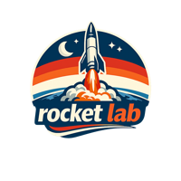
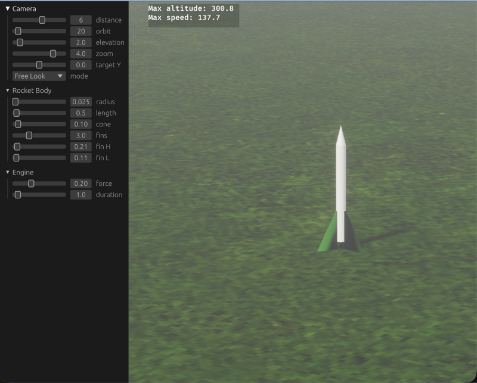

<p align="center">
  
</p>

# Bevy Rocket Lab

A model rocketry simulator/game built with [Bevy](https://bevyengine.org/) 0.18. Early stage — currently a sandbox/tech demo.

Why? I recently revisited model rocketry with my children and found myself writing a python script to discern where our first launch might have landed. After that, I thought it might be fun to explore the idea a bit more.

<p align="center">
  
</p>

## Quick Start

```bash
just run          # dev build + run
just fmt          # format code
just release      # optimized build
just serve-wasm   # build WASM + serve at localhost:8080
```

Requires [rustup](https://rustup.rs/)-managed Rust (not Homebrew). See [DEV.md](DEV.md) for module overview, toolchain setup, WASM builds, and troubleshooting.

## TODO

- Minimum playable game (not sandbox mode)
  - Rocket building (currency, purchase body/cone/engines/fins/parachute/launch pads)
  - Objectives (landing, elevation, etc.) with constraints (wind, build deficiencies)
  - Title and game over screens
- Publish to web (WASM build works, needs polish)

## Ideas

- Better terrain ([blog post](https://clynamen.github.io/blog/2021/01/04/terrain_generation_bevy/), [warbler_grass](https://github.com/EmiOnGit/warbler_grass))
- Proper change detection via components
- Expand game states
- Camera upgrades (mouse pancam, FPS controller)

## Acknowledgements

This project should be distinct from [OpenRocket](https://openrocket.info/), which is pretty good at what it does. Maybe some future interoperability?

Based on [bevy-egui-playground](https://github.com/whoisryosuke/bevy-egui-playground) — thanks, whoisryosuke! Big thanks to my bro for inspiring me with his neat Bevy game jam entries ([itch.io](https://euclidean-whale.itch.io/)).

Thanks to [Claude Opus 4.6](https://claude.ai/code) for helping migrate from Bevy 0.13 to 0.18, churning through five major versions of API changes, and getting the WASM build working.

## References

- [nbody simulation](https://github.com/pjankiewicz/nbody/tree/master/src)
- [avian3d](https://github.com/Jondolf/avian) (formerly bevy_xpbd_3d)
- [bevy_firework pitch/yaw](https://github.com/mbrea-c/bevy_firework/blob/master/src/emission_shape.rs)
